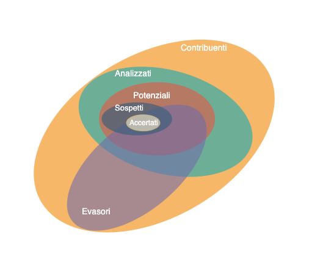

Il vice-ministro dell'Economia e delle Finanze con delega al fisco Maurizio Leo ha dichiarato nell'audizione con la Commissione parlamentare di vigilanza sull’anagrafe tributaria:

> "L’evasione fiscale è come un macigno, tipo il terrorismo. Quando abbiamo 80-100 miliardi di evasione capiamo che si deve tutti collaborare, nel rispetto dei dati personali. Quello che si deve fare, ed è quello su cui stiamo lavorando con Agenzia delle Entrate e Sogei, è il cosiddetto data scraping, ovvero non fermarci a ragionare solo sui dati relativi all’attività professionale (superando quindi gli attuali Indici sintetici di affidabilità fiscale usati per valutare autonomi e partite IVA, ndr) ma vedere pure gli elementi significativi del tenore di vita: professionisti e imprenditori vanno su internet e sui social e dicono dove sono stati in vacanza o in quale ristorante."

Probabilmente sarà una modalità di approfondimento legata alla non adesione al concordato

> "Quelli che non aderiranno [al concordato], entreranno in liste selettive, per vedere che non hanno potuto realizzare questi compensi. Ma se si vede che ci sono delle anomalie, là si deve intervenire"


Dovrebbe essere disponibile a breve il [Resoconto ufficiale](https://www.camera.it/leg19/824?tipo=C&anno=2024&mese=01&giorno=31&view=filtered&commissione=31&pagina=#data.20240131.com31.bollettino.sede00010.tit00020) della seduta del 31 Gennaio 2024.


## Cosa è il data scraping

Il termine *"data scraping"* si riferisce all'operazione di estrazione automatizzata di dati da pagine web, documenti online (ad esempio file pdf) o applicazioni social con lo scopo di ottenere informazioni strutturate che possano essere successivamente elaborate.

Il termine "scraping" in questo contesto potrebbe essere tradotto come "ritaglio", facendo riferimento all'analogia con il ritagliare frammenti di giornali per collezionare ed organizzare informazioni utili su un dato argomento.


### Tecniche

Tecnicamente l'operazione può essere svolta con due modalità principali:

- tramite l'analisi del contenuto dei documenti web tramite opportuni programmi che si "trascinano" (crawling) attaverso le pagine e "ritagliano" (scraping) i dati rilevanti,
- tramite le A.P.I. delle applicazioni social (sono un canale un accesso diretto ai dati che vengono mostrati nella pagine dei social) che sono gestiti dalle aziende social (es. Meta, X, etc.)

Entrambi gli approcci sono strettamente vincolati (quasi ostacolati) dai social perchè un acceso aperto (come in altre piattaforme, ad es. FediVerse/Mastodon) andrebbe a vanificare completamente il loro modello di business.


### Perchè si usa

Le tecniche di "data scraping" sono state largamente utilizzate per poter accedere a dati che sono disponibili pubblicamente ma non in formato aperto.

Dati in formato non elaborabile da un calcolatore oppure non strutturata sono ad esempio:

- i dati delle dichiarazioni dei redditi dei parlamentari che sono delle scansioni
- i dati finanziari (es. bilanci) di società pubblicati come scansioni oppure come pdf
- i dati disponibili su pagine web ma non "aperti" e scaricabili facilmente

Quindi ci sono usi "nobili" di questa tecnica, ad esempio da parte di cittadini attivisti per rendere i dati più facilmente accessibili e scrutinabili.

Talvolta sono utilizzati per aggregare dati disponibili in maniera sparsa e non aperta su portali web (es. annunci case, ebay)

Infine può essere utilizzato per "profilare" le persone con gli scopi più vari.

Un caso di uso di uso di data scraping per estrarre informazioni aggiuntive (sebbene non applicato a social) ma altre tipologie di siti che contengono dati finanziari è quello portato avanti dal [governo francese](https://algorithmwatch.org/en/france-tax-automated-dgfip/) che ha un team di data analyst dedicato a scovare possibili evasori.


## Estrazione delle informazioni

Il tipo di informazioni estraibili tramite "data scraping" sono molto varie.
Con riferimento alle affermazioni del Vice-Ministro, possiamo pensare che si vogliano estrarre
i dati relativi ai luoghi, sia geografici che locali (ristoranti etc.), ed ai tempi delle visite.

Tali informazioni possono essere estratte a partire da quanto pubblicato sui propri profili social dai soggetti di interesse.


### Esempio: luoghi visitati da Instagram

- si cerca il profilo Instagram di un contribuente, non semplice perché potrebbe essere un nome comune e molti profili sono privati, quindi inaccessibili; si può fare ricorso alle informazioni di descrizione de profilo inserite dall'utente

- identificato il profilo è possibile analizzare le foto e i dati associati ad esso

- dato un post (che può includere una o più foto) è possibile ottenere alcune informazioni, ad esempio il luogo e la data e i tag che possono concorrere a identificare il luogo, 
    ad esempio con alcune istruzioni Javascript:

    ```js
    date=document.getElementsByTagName("time");
    date=date[date.length-1].dateTime;
    a=Array.from(document.getElementsByTagName("a"));
    place=a.filter( e => e.href.contains("/explore/location") ).map( e => e.textContent ).join(" ");
    tags=a.filter( e => e.href.contains("/explore/tag") ).map( e => e.textContent ).join(" ");
    ```

- analizzando più post si possono ricostruire il luoghi in cui è stata questa persona nel tempo, ad es.

    | Periodo                | Luogo                             |
    |------------------------|-----------------------------------|
    | 29/9/2023 - 27/10/2023 | Torino
    | 10/8/2023 - 16/8/2023  | Germania
    | 25/7/2023 - 21/7/2023  | Piemonte
    | ...


## Individuazione dei sospetti

A partire dalla lista dai luoghi visitati occorre per prima di tutto individuare i *"potenziali evasori"*. Ad esempio tramite l'individuazione di una soglia su numero e tipologia dei luoghi. Questo significa avere a disposizione una banca dati con una classificazione delle mete di viaggi o dei locali. Tanto più accurata è questa classificazione tanto più costerà costruirla e mantenerla nel tempo. Questa fase di selezion eragionevolmente potrà essere eseguita in maniera automatizzata, ad esempio con tecniche di Machine Learning.

Questo approccio produce un numero molto alto di **falsi positivi**, ovvero casi che potrebbero essere evasori ma di fatto non lo sono. Occore quindi ridurre i falsi positivi per identificare quelli che possiamo chiamare *"sospetti evasori"*, in pratica:

- verificare quali attività sono personali e quindi indicatori del tenore di vita: molte persone viaggiano frequentemente per motivi di lavoro e quindi frequentano spesso luoghi e locali o ristoranti
- verificare che le attività siano effettivamente legate al reddito o patrimonio del soggetto: molte persone viaggiano con parenti, compagni, amici 
- inoltre il costo di un viaggio può avere costi molto variabili, se ci fossero post di specifici hotel e ristorandi questo potrebbe facilitare la stima

Effetuare queste verifiche può risultare non facile, potrebbe essere svolto solo in parte da un sistema di IA (che sarebbe da sviluppare ad hoc) e sicuramente richiede un grande lavoro "manuale" da parte degli addetti umani.

A questo punto occorre condurre delle indagini vere e proprie per accertare l'eventuale evasione. Questa fase richiede un inteso lavoro investigativo che potrebbe essere invano se la lista dei sospetti è poco precisa e contiene tanti falsi positivi.


## Limiti dell'approccio

Complessivamente i vari passaggi possono essere visti come modi di ridurre sempre più il cerchio, fino a avere degli evasori accertati:




### Limiti di rappresentazione

Quali contribuenti di interesse sono rappresentati nella base di dati raccolti?

Un contribuente è analizzabile se è possibile raccogliere informazioni utili, ovvero solo se: 

- **C0**: il contribuente ha dei profili social
- **C1**: si associa a un contribuente uno o più profili social
- **C2**: il profilo è pubblico
- **C3**: per i suoi post si associano dei luogo, ovvero:
    - il luogo è indicato esplicitamente nel post
    - il luogo è menzionato nel testo o nei tag
    - i contenuti della fotografia sono riconoscibili


Se il profilo è privato, per poter accedere è necessario trovarsi in una delle seguenti condizioni particolari:
    - chi fa lo scraping è "amico" del soggetto sul quale si stanno raccogliendo informazioni
    - esiste una richiesta di un magistrato per accedere ai dati

Queste condizioni riducono molto il numero di contribuenti per cui è possibile analizzare i dati (errore di rappresentazione).


### Limiti di descrizione (misura)

Dato un soggetto su cui sono stati raccolti i dati, questi ne descrivono adeguatamente il comportamento "reale"?

La fondamentale assunzione necessaria perchè questo approccio abbia senso è che i contribuenti postino sui social buona parte delle proprie attività (errore di completezza della misura).

Inoltre, per avere un'idea accurata del tenore di vita dei soggetti, è necessario che i passi di scrematura e verifica siano corretti. Le possibili cause sono: errore umano, difetto o bias del software, errore nei dati di riferimento.

Questi possibilie errori riducono ulteriormente il numero di contribuenti su cui è possibile fare una stima corretta del tenore di vita.


### Costi

È evidente che questa iniziativa avrà dei costi non trascurabili:

- sviluppo del software di "data scraping"
- manutenzione e aggiornamento del software (l'unico sw che non si deve evolvere è quello che non viene usato)
- attività umane di verifica
- attività umane di accertamento

Per valutare la convenienza dell'iniziativa occorre capire quanti saranno gli evasori effettivamente accertati e l'ammontare recuperato.

Indicativamente, al momento pare che il rapporto tra incassato e accertato sia circa il 10%.

Quindi a fronte di costi non indifferenti i benefici rischiano di essere molto ridotti.


## Considerazioni sulla privacy

Mettere in piedi un'iniziativa come quella ipotizzata dal Vice-Ministro comporterà la raccolta di una mole notevole di informazioni su cittadini che, come indicato nelle dichiarazioni, dovrà essere valutata accuratamente dal Garante per la Privacy.

Alcuni di questi dati personali sono:

- l'associazione massiva di cittadini a profili social, che potrebbe essere usata in maniera impropria per scopi di sorveglianza e profilazione, questa associazione è stata spesso riproposta da politici di tutti gli schieramenti (tutti con scarsa comprensione della privacy), un uso non appropriato o un "leak" di queste informazioni sarebbe gravissimo specie per personi in condizioni più fragili;

- una estesa raccolta di luoghi frequentati, più o meno abitualmente, con eventuali orari da cui è possibile desumere abitudini e spostamenti.

In generale è importante definire (come da GDPR) chi custodirà queste informazioni, chi vi potrà accedere, e con quali scopi. La tentazione di usare informazioni raccolte con uno scopo iniziale per altri scopi è sempre in agguato e molto problematica per la privacy.

Un caso analogo, anche se non basato su dati social, legato a risk report per servizi di welfare (SyRI) si è verificato in Olanda: dove il sistema è stato [bloccato da una sentenza](https://journals.sagepub.com/doi/full/10.1177/13882627211031257) perché non conforme al GDPR.

E il solito adagio che chi non ha niente da nasconodere non ha niente da temere è quasi troppo banalmente sbagliato per essere menzionato.

Carlo Blengino [scriveva](https://www.ilpost.it/carloblengino/2016/11/02/ho-qualcosa-da-nascondere/) qualche tempo fa:

> Io ho qualcosa da nascondere da quando ho ricordi: sono riservatezze variabili a seconda dell’interlocutore, del tempo, del luogo e del contesto. E non voglio per me e i miei figli una società stupidamente disciplinata da una costante sorveglianza e decerebrata dagli algoritmi. Vorrei una società in cui l’asimmetria dell’informazione sia l’esatto opposto dell’attuale, dove purtroppo il cittadino è totalmente trasparente e lo Stato e le sue regole sono opache e incerte.

## Conclusioni

Esistono diversi limiti rappresentazione e di misura che riducono il numero di soggetti a cui è effettivamente possibile applicare l'approccio basato sul "data scraping".

In ogni caso il costo di questa iniziativa potrebbe essere non trascurabile sia per l'avvio che per l'operatività nel tempo.
Ad esempio, potrebbe comportare un lavoro aggiuntivo per gli addetti, che potrebbero non essere in grado di svolgere le altre normali attività di controllo.

Infine ci sono aspetti di privacy non trascurabili. A questo proposito è bene ricordare che una raccolta dati di questo tipo potrebbe essere fatta da chiunque. Quindi la raccomandazione è di mantenere i profili privati o se sono pubblici (ad esempio perchè utili per lavoro) fare molta attenzione a cosa si pubblica.
